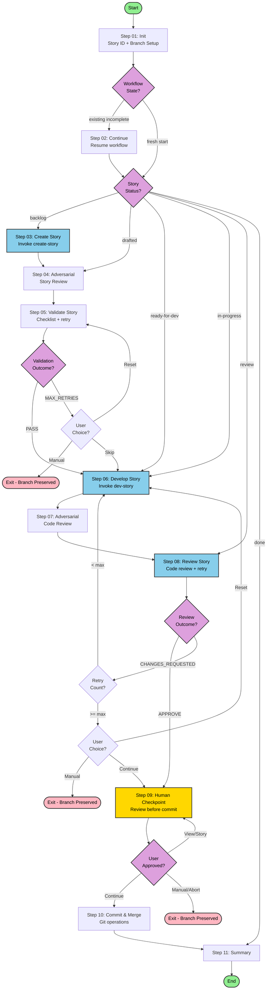

# Orchestrate Story Workflow

Execute complete BMAD story workflow: create → develop → review → merge with automated validation and human review checkpoint.

## Overview

This workflow orchestrates the complete story lifecycle through 11 steps:

1. **Init** — Identify story from sprint-status.yaml, setup branch, route to entry point
2. **Continue** — Resume workflow from previous session (if applicable)
3. **Create Story** — Invoke create-story sub-workflow
4. **Adversarial Story Review** — Fresh perspective review (optional, with automatic retry)
5. **Validate Story** — Run validation checklist with retry loop
6. **Develop Story** — Invoke dev-story sub-workflow
7. **Adversarial Code Review** — Fresh perspective review of code diff (optional, with automatic retry)
8. **Review Story** — Formal code review with retry loop
9. **Human Checkpoint** — Review all changes before commit
10. **Commit & Merge** — Git operations
11. **Summary** — Final report and next story identification

## Flow Diagram



## Legend

- **Green (Start/End)**: Workflow entry and exit points
- **Yellow (Checkpoint)**: Human review checkpoint requiring explicit approval
- **Blue (Workflow)**: Sub-workflow invocations
- **Pink (Exit)**: Exit points with state preservation
- **Purple (Decision)**: Decision points

## File Structure

```
_bmad-custom-src/
├── tasks/
│   ├── retry-with-feedback.md           # Shared retry task
│   ├── validate-adversarial-review.md   # Adversarial review validation wrapper
│   └── validate-workflow.xml            # Validation task
└── workflows/
    └── orchestrate-story/
        ├── config.yaml                   # Sub-workflow refs, models, settings
        ├── workflow.md                   # Entry point
        ├── steps-c/
        │   ├── step-01-init.md           # Story ID + branch + routing
        │   ├── step-02-continue.md       # Resume workflow
        │   ├── step-03-create-story.md   # Create story
        │   ├── step-04-adversarial-story-review.md  # Adversarial story review
        │   ├── step-05-validate-story.md # Validate with retry
        │   ├── step-06-develop-story.md  # Development
        │   ├── step-07-adversarial-code-review.md   # Adversarial code review
        │   ├── step-08-review-story.md   # Code review with retry
        │   ├── step-09-human-checkpoint.md # Human review gate
        │   ├── step-10-commit-merge.md   # Git operations
        │   └── step-11-summary.md        # Final summary
        ├── data/
        │   ├── delegation-blocks.md      # Delegation block templates
        │   ├── routing-table.md          # Story status routing reference
        │   └── workflow-state-structure.md # State file structure reference
        ├── checklist.md                  # Validation checklist
        └── README.md                     # This file
```

## State Machine

The workflow uses dual-state routing:

1. **Workflow state** (`orchestrate-story-state.yaml`): Tracks `stepsCompleted`, `lastStep`, `lastContinued`
2. **Domain state** (`sprint-status.yaml`): Tracks story status

### Routing Logic

- If workflow state file exists and workflow incomplete → Route to `step-02-continue.md`
- Otherwise → Route to `step-01-init.md` (fresh start)

### Story Status Entry Points

| Status            | Entry Step | Action                   |
| ----------------- | ---------- | ------------------------ |
| `backlog`       | step-03    | Create story file        |
| `drafted`       | step-04    | Adversarial story review |
| `ready-for-dev` | step-06    | Develop story            |
| `in-progress`   | step-06    | Resume development       |
| `review`        | step-08    | Code review              |
| `done`          | step-11    | Summary only             |

## Key Features

### Automatic Retry with Feedback

Validation (step 05), adversarial reviews (steps 04, 07), and code review (step 08) use the `retry-with-feedback` task which:

- Executes validation/review
- On failure: automatically retries with accumulated feedback
- Tracks retry count up to configurable maximum
- Returns structured outcome for step to handle

### Adversarial Review

Steps 04 and 07 provide fresh-perspective reviews:

- **Step 04**: Adversarial story review catches issues before checklist validation
- **Step 07**: Adversarial code review catches implementation issues before formal review
- Both use retry-with-feedback with separate retry limit (`adversarial_max_retries: 3`)
- Both run in fresh sub-agent context (gemini-3-pro) for unbiased review
- Automatically retry by invoking create-story/dev-story workflows with feedback

### Single Human Checkpoint

Step 09 provides one human review gate before commit:

- Shows summary of all phases
- Displays git diff stats
- Allows viewing full changes
- Requires explicit approval to proceed

### State Preservation

On exit at any point:

- Story branch preserved locally
- Sprint status reflects current progress
- Workflow state file tracks completed steps
- Workflow can be resumed by running again

## Configuration

Edit `config.yaml` to customize:

### Sub-workflows

- `sub_workflows.create_story`: Path to create-story workflow
- `sub_workflows.dev_story`: Path to dev-story workflow
- `sub_workflows.code_review`: Path to code-review workflow

### Models

- `models.create_story`: Model for story creation (default: opus-4.5-thinking)
- `models.validate_story`: Model for validation (default: gpt-5.2)
- `models.fix_validation`: Model for fixing validation issues (default: composer-1)
- `models.dev_story`: Model for development (default: opus-4.5-thinking)
- `models.code_review`: Model for code review (default: gemini-3-pro)
- `models.fix_review`: Model for fixing review issues (default: composer-1)
- `models.adversarial_validate`: Model for adversarial review (default: gemini-3-pro)

### Runtime Settings

- `max_retries`: Maximum retry attempts for validation/review (default: 5)
- `adversarial_max_retries`: Maximum retry attempts for adversarial review (default: 3)

### Paths

- `workflow_state_file`: Path to orchestrate-story-state.yaml
- `sprint_status`: Path to sprint-status.yaml
- `story_dir`: Path to stories directory

### Tasks

- `retry_task`: Path to retry-with-feedback task
- `validation_task`: Path to validation task
- `adversarial_review_task`: Path to adversarial review task
- `adversarial_validation_task`: Path to adversarial validation wrapper task

### Skills

- `skills.subprocess`: Path to subprocess delegation skill

## Usage

1. Ensure sprint-status.yaml has a story with status `backlog` through `review`
2. Invoke the workflow via BMAD agent or command
3. Workflow identifies story and routes to appropriate step
4. Follow prompts and approve at human checkpoint
5. Workflow commits and merges on completion

## Workflow State File Structure

The workflow tracks state per story in `orchestrate-story-state.yaml`:

```yaml
workflows:
  STORY-123:
    workflow_state:
      stepsCompleted: []
      lastStep: ''
      lastContinued: ''
      workflowVersion: 'v6'
    execution_metadata:
      parentBranch: 'main'
      storyBranch: 'story/STORY-123'
      startedAt: '2026-01-26T22:46:28Z'
      lastActivity: '2026-01-26T22:46:28Z'
    domain_reference:
      storyStatus: 'backlog'
      storyFile: 'stories/STORY-123.md'
```
