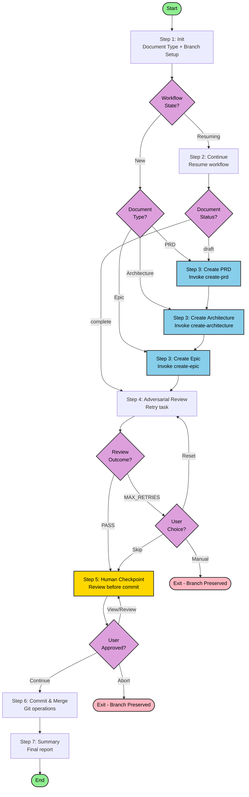

# Orchestrate Planning Documents Workflow

Execute complete BMAD planning document workflow: create → review → merge with automated adversarial review validation and human review checkpoint.

## Overview

This workflow orchestrates the complete planning document lifecycle for PRD, Architecture, and Epic documents:

1. **Init** — Document type selection, branch setup, determine entry point
2. **Continue** — Handle workflow continuation from previous session (if resuming)
3. **Create Document** — Invoke create-[doc-type] sub-workflow (PRD, Architecture, or Epic)
4. **Adversarial Review** — Fresh perspective review with automatic retry loop
5. **Human Checkpoint** — Review all changes before commit
6. **Commit & Merge** — Git operations
7. **Summary** — Final report

## Flow Diagram



## Legend

- **Green (Start/End)**: Workflow entry and exit points
- **Yellow (Checkpoint)**: Human review checkpoint requiring explicit approval
- **Blue (Workflow)**: Sub-workflow invocations
- **Pink (Exit)**: Exit points with state preservation
- **Purple (Decision)**: Decision points

## File Structure

When installed, content lives under `_bmad/my-custom-bmad/`:

```
_bmad/my-custom-bmad/
├── tasks/
│   └── retry-with-feedback.md      # Shared retry task
└── workflows/
    └── orchestrate-planning-documents/
        ├── config.yaml             # Sub-workflow refs, models, settings
        ├── workflow.md             # Entry point
        ├── steps-c/
        │   ├── step-01-init.md                    # Document type + branch + routing
        │   ├── step-02-continue.md               # Resume workflow
        │   ├── step-03-create-document.md        # Create document (PRD/Architecture/Epic)
        │   ├── step-04-adversarial-review.md     # Adversarial review with retry
        │   ├── step-05-human-checkpoint.md       # Human review gate
        │   ├── step-06-commit-merge.md           # Git operations
        │   └── step-07-summary.md                # Final summary
        ├── data/
        │   ├── delegation-blocks.md               # Subprocess invocation patterns
        │   ├── routing-table.md                  # State-based routing logic
        │   └── workflow-state-structure.md       # State file schema
        └── README.md               # This file
```

## State Machine

The workflow routes to the appropriate step based on document status:

| Status | Entry Step | Action |
|--------|------------|--------|
| `draft` or incomplete | step-03 | Create/resume document creation |
| `complete` | step-04 | Adversarial review |

**Routing Logic:**
- If workflow state file exists and workflow incomplete → Route to `step-02-continue.md`
- If workflow state file doesn't exist or workflow complete → Route to `step-01-init.md` (fresh start)
- Document status from tracking file determines which step to resume from (if workflow was interrupted mid-document)

## Key Features

### Document Type Selection

The workflow handles one document type per execution:
- **PRD**: Product Requirements Document
- **Architecture**: Solution Architecture Document
- **Epic**: Epic Document

User selects the document type at workflow start (via command argument or interactive prompt).

### Automatic Retry with Feedback

Adversarial review (step 4) uses the `retry-with-feedback` task which:
- Executes adversarial validation
- On failure: automatically retries with accumulated feedback
- Tracks retry count up to configurable maximum (`adversarial_max_retries`)
- Updates workflow state to `fixing` during retry loop
- Returns structured outcome for step to handle

### Adversarial Review

Step 4 provides fresh-perspective review:
- Uses `validate-adversarial-review` task for skeptical perspective
- Runs in fresh sub-agent context (gemini-3-pro) for unbiased review
- Automatically retries by invoking create-[doc-type] workflows with feedback
- Tracks `retryCount` in workflow state during fixing state
- User can skip review even during fixing state

### Single Human Checkpoint

Step 5 provides one human review gate before commit:
- Shows document type and file path
- Displays git diff stats
- Allows viewing full changes or document
- Requires explicit approval to proceed
- Options: Continue, View changes, View document, Manual review, or Abort

### State Preservation

On exit at any point:
- Document branch preserved locally (`{doc-type}/{document-key}`)
- Workflow state file reflects current progress
- Document-specific tracking file reflects current status
- Workflow can be resumed by running again

### Git Operations

- **Branch Creation**: Creates `{doc-type}/{document-key}` branch at start
- **Commit**: Updates document status to `complete`, commits all changes
- **Merge**: Merges document branch back to parent branch
- **Conflict Handling**: Detects and reports merge conflicts

## Configuration

Edit `config.yaml` to customize:

- **sub_workflows**: Paths to create-prd, create-architecture, create-epic
- **models**: Model selection for each subagent routing
  - `create_prd`: Model for PRD creation (default: opus-4.6-thinking)
  - `create_architecture`: Model for Architecture creation (default: opus-4.6-thinking)
  - `create_epic`: Model for Epic creation (default: opus-4.6-thinking)
  - `adversarial_validate`: Model for adversarial review (default: gemini-3-pro)
  - `fix_validation`: Model for fixing validation issues (default: composer-1)
- **adversarial_max_retries**: Maximum retry attempts for adversarial review (default: 1)
- **tracking_files**: Paths to document-type-specific tracking files
- **workflow_state_file**: Path to orchestrator workflow state file

## Usage

### Via Slash Command

```
/orchestrate-bmad-planning-documents
```

The workflow will:
1. Prompt for document type selection (PRD, Architecture, or Epic)
2. Route to appropriate step based on document status in tracking files
3. Execute sub-workflows (create-prd, create-architecture, create-epic)
4. Perform adversarial review with retry loops
5. Present human checkpoint before commit
6. Commit and merge on approval

### Manual Invocation

1. Load `workflow.md` from the workflow directory
2. Follow the initialization sequence:
   - Load config from `config.yaml`
   - Load bmb config for output_folder, user_name, communication_language
   - Load bmm config for planning_artifacts
   - Execute `steps-c/step-01-init.md` to begin

### Prerequisites

- Planning artifacts folder configured in bmm config
- Sub-workflows (create-prd, create-architecture, create-epic) available
- Git repository initialized
- Tracking files will be created automatically in planning_artifacts folder

## Tracking Files

The workflow uses document-type-specific tracking files:

- `orchestrate-prd-state.yaml` — Tracks PRD documents
- `orchestrate-architecture-state.yaml` — Tracks Architecture documents
- `orchestrate-epic-state.yaml` — Tracks Epic documents

Each tracking file contains:
- Document file path (as key)
- Workflow state (stepsCompleted, lastStep, retryCount)
- Execution metadata (branch, timestamps, document type)
- Domain reference (document status, review status)

These files persist for audit purposes and enable resumability.
