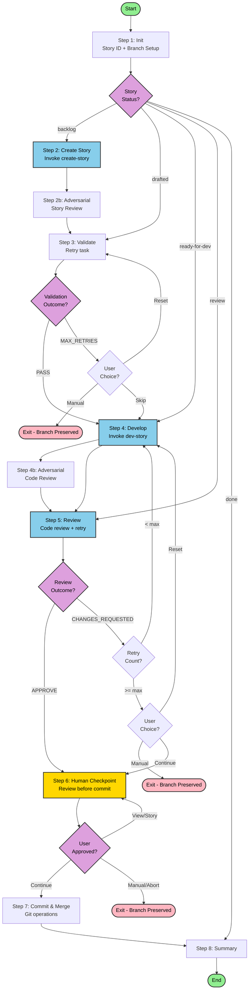

# Orchestrate Story Workflow

Execute complete BMAD story workflow: create → develop → review → merge with automated validation and human review checkpoint.

## Overview

This workflow orchestrates the complete story lifecycle:

1. **Identify** story from sprint-status.yaml
2. **Create** story file via create-story sub-workflow
2b. **Adversarial Story Review** — Fresh perspective review (optional, with automatic retry)
3. **Validate** story against checklist (with automatic retry)
4. **Develop** story via dev-story sub-workflow
4b. **Adversarial Code Review** — Fresh perspective review of code diff (optional, with automatic retry)
5. **Review** code via code-review sub-workflow (with automatic retry)
6. **Checkpoint** human review before commit
7. **Commit** and merge to parent branch
8. **Report** summary and identify next story

## Flow Diagram



## Legend

- **Green (Start/End)**: Workflow entry and exit points
- **Yellow (Checkpoint)**: Human review checkpoint requiring explicit approval
- **Blue (Workflow)**: Sub-workflow invocations
- **Pink (Exit)**: Exit points with state preservation
- **Purple (Decision)**: Decision points

## File Structure

When installed, content lives under `_bmad/my-custom-bmad/`:

```
_bmad/my-custom-bmad/
├── tasks/
│   └── retry-with-feedback.md      # Shared retry task
└── workflows/
    └── orchestrate-story/
        ├── config.yaml             # Sub-workflow refs, models, settings
        ├── workflow.md             # Entry point
        ├── steps-c/
        │   ├── step-01-init.md                    # Story ID + branch + routing
        │   ├── step-02-continue.md               # Resume workflow
        │   ├── step-03-create-story.md            # Create story
        │   ├── step-04-adversarial-story-review.md # Adversarial story review (optional)
        │   ├── step-05-validate-story.md          # Validate with retry
        │   ├── step-06-develop-story.md           # Development
        │   ├── step-07-adversarial-code-review.md # Adversarial code review (optional)
        │   ├── step-08-review-story.md            # Code review with retry
        │   ├── step-09-human-checkpoint.md        # Human review gate
        │   ├── step-10-commit-merge.md            # Git operations
        │   └── step-11-summary.md                 # Final summary
        ├── checklist.md            # Validation checklist
        └── README.md               # This file
```

## State Machine

The workflow routes to the appropriate step based on story status:

| Status | Entry Step | Action |
|--------|------------|--------|
| `backlog` | step-03 | Create story file |
| `drafted` | step-04 | Adversarial story review |
| `ready-for-dev` | step-06 | Develop story |
| `in-progress` | step-06 | Resume development |
| `review` | step-08 | Code review |
| `done` | step-11 | Summary only |

## Key Features

### Automatic Retry with Feedback

Validation (step 3), adversarial reviews (steps 2b, 4b), and code review (step 5) use the `retry-with-feedback` task which:
- Executes validation/review
- On failure: automatically retries with accumulated feedback
- Tracks retry count up to configurable maximum
- Returns structured outcome for step to handle

### Adversarial Review (Optional)

Steps 2b and 4b provide fresh-perspective reviews:
- **Step 2b**: Adversarial story review catches issues before checklist validation
- **Step 4b**: Adversarial code review catches implementation issues before formal review
- Both use retry-with-feedback with separate retry limit (`adversarial_max_retries: 3`)
- Both run in fresh sub-agent context (gemini-3-pro) for unbiased review
- Automatically retry by invoking create-story/dev-story workflows with feedback

### Single Human Checkpoint

Step 6 provides one human review gate before commit:
- Shows summary of all phases
- Displays git diff stats
- Allows viewing full changes
- Requires explicit approval to proceed

### State Preservation

On exit at any point:
- Story branch preserved locally
- Sprint status reflects current progress
- Workflow can be resumed by running again

## Configuration

Edit `config.yaml` to customize:

- **sub_workflows**: Paths to create-story, dev-story, code-review
- **models**: Model selection for each subagent routing
  - `adversarial_validate`: Model for adversarial review (default: gemini-3-pro)
- **max_retries**: Maximum retry attempts for validation/review (default: 5)
- **adversarial_max_retries**: Maximum retry attempts for adversarial review (default: 3)
- **adversarial_validation_task**: Path to adversarial validation wrapper task

## Usage

1. Ensure sprint-status.yaml has a story with status `backlog` through `review`
2. Invoke the workflow via BMAD agent or command
3. Workflow identifies story and routes to appropriate step
4. Follow prompts and approve at human checkpoint
5. Workflow commits and merges on completion
